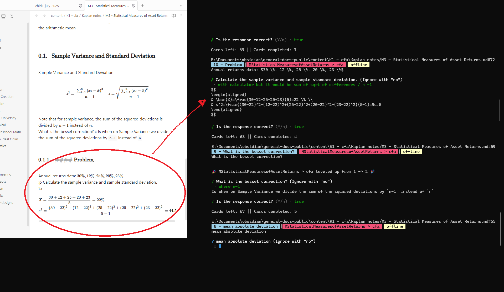
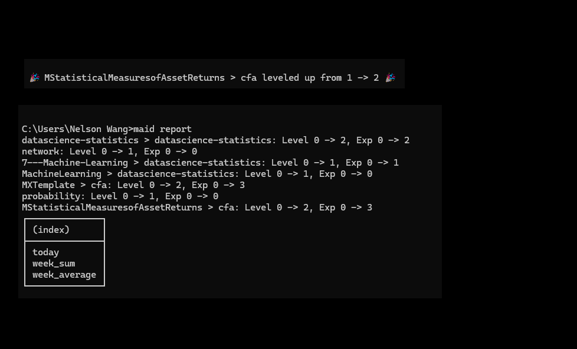

# Mastery CLI


Docs: https://nenewang.github.io/mastery-cli/

Mastery CLI: Your Command Line Assistant for Programmer Development"

Mastery CLI is a comprehensive tool designed to boost your programming skills. It features flashcards, DSA practice, statistics, and habit hooks. For instance, every commit now triggers a random flashcard or suggests a DSA problem to solve, fostering continuous learning.


| features                                                                | img                                   |
| ----------------------------------------------------------------------- | ------------------------------------- |
| Convert your Markdown Notes into Flashcards                             |  |
| Upgrade your skills, and keep record of your progress with Mastery CLI. |       |


Key Highlights:

- Easily track personal project goals, such as daily commits.
- Access over 150 offline programming problems with accompanying offline tests and a built-in compiler.
- Seamlessly collect and sync progress across devices when connected to the internet.
- Establish habit hooks, like integrating flashcards and math practice into your development cycle.
- Utilize an offline algorithm that identifies weaknesses and generates quick flashcards for memory refresh.
- Enjoy free flashcard decks covering Computer Science Architecture, Networking, AWS, System Design, Design Patterns, and more. Plus, easily share your flashcard decks.


## Install and Test.
```
npm install -g mastery-cli
mcli report
mcli quiz
mcli report
```

- You need to install nvim for the dsa option to work
- Eventually you would be able to select your own editor.


## Help

We support multiple ways to call the cli, for instance, you can use `mastery-cli`, `mastery`, or `mcli` to access the tool. 

Supported calls:

```
mcli
mastery
m-cli
```

### Settings.

Change the editor in 

```
utils/dsa-cli/user_files/temp_settings.json
```

## Usage

Commiting a code and pushing it to HEAD

```
mcli coa "Commit message"
```


Reporting:

```
mcli report
```


Help 

```
mcli --help
```


## Skills Integration

Now you can track locally the type of cards you are studying, and the type of problems you are solving.
You will be able to see the progress of your skills, and the type of problems you are solving.

```
mcli skill
```

### Data Structures and Algorithms 
We have a collection of DSA problems that you can solve.

View DSA problems:
```
mcli dsa
```

- We keep track of solved problems, as well as new problems.


View all DSA Problems

```
mcli dsa --all
```

### Flashcards

```
mcli term
```

Math Problems:

```
mcli math
```


