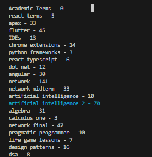

# Mastery CLI


Your assistant to improve as a programmer. Flashcards, DSA Practice, Statistics, and habit hooks. For example, everytime you commit code, you could have a random flashcard being prompted (or even a random DSA problem suggestion to be completed!). Designed to work offline, but when connected to the internet assists you to collect your progress and sync it with your other devices. 


Other main features include:
- Helping you keep track on your personal goal projects e.g. Doing some commit in a project on a daily basi
- More than 150 programming problems (with tests that work offline)


## Install

```
npm install -g mastery-cli
```

- You need to install nvim for the dsa option to work
- Eventually you would be able to select your own editor.

Recommended:

```
Install nvim
```

## Version

```

```


## Usage

Commiting a code and pushing it to HEAD

```
mastery coa "Commit message"
```


Reporting:

```
mastery report
```


Help 

```
mastery --help
```


### DSA 

View DSA problems

```
mastery dsa
```


View all DSA Problems

```
mastery dsa --all
```

### Flashcards

```
mastery term
```

Math Problems:

```
mastery math
```
Advantage and Reasoning

This wa advantageous because the client api had the flexibility to work with the individual components, lets say, 'kotlin flashcards' in the same way it would trat the entire hierarchy e.g. 'programming flashcards'.

This is an example of how the strucutre supports both itself and their children components:

```js


    /**
     * Returns list of deck title. e.g.
     * [kotlin, java, javascript...]
     */
    get deck_titles() {
        const deck_names = [this.deck_name];
        for (const deck of this.decks) {
            deck_names.push(...deck.deck_titles);
        }
        return deck_names;
    }

    
    /**
     * Returns list of deck titles with the count of cards inside: e.g.:
     * [kotlin - 3, java - 5, javascript - 10...]
     */
    get deck_titles_with_count(){
        const deck_names = [`${this.deck_name} - ${this.terms.length}`];
        for (const deck of this.decks) {
            deck_names.push(...deck.deck_titles_with_count);
        }
        return deck_names;
    }

```




**Solid Principles**

    S - Single-responsiblity Principle
    O - Open-closed Principle
    L - Liskov Substitution Principle
    I - Interface Segregation Principle
    D - Dependency Inversion Principle

Listov Substitution Principle:
This means that every subclass or derived class should be substitutable for their base or parent class.

**Deliverate Practice and the Scheduling System**

Deliberate practice refers to a special type of practice that is purposeful and systematic. While regular practice might include mindless repetitions, deliberate practice requires focused attention and is conducted with the specific goal of improving performance.


**Optimization**

async/await: The async/await syntax, introduced in ECMAScript 2017 (ES8), provides a more intuitive way to work with asynchronous code. The async keyword is used to define asynchronous functions, and the await keyword is used within these functions to pause execution until a promise is resolved. This makes asynchronous code appear more like synchronous code, which can be easier to understand.

**Testing**

Scope:

    Unit Testing:
        Focuses on testing individual components or units of code in isolation, such as functions, methods, or classes.
        The primary goal is to ensure that each unit of code works correctly as per its design and specifications.
        Typically written and executed by developers during the coding phase.

    Functional Testing:
        Focuses on testing the entire software application or specific functionalities as a whole.
        The primary goal is to verify that the software functions correctly according to specified requirements, user expectations, and the intended use cases.
        Conducted on a fully integrated and assembled system.

Isolation:

    Unit Testing:
        Isolates the unit being tested from the rest of the application by using mock objects, stubs, or other techniques.
        Dependencies on external systems, components, or services are typically simulated or replaced.

    Functional Testing:
        Does not isolate individual units but tests the application in a real-world environment with all its components, including external dependencies.

Test Scope:

    Unit Testing:
        Tests focus on the smallest code units, such as individual functions or methods.
        Granular and fine-grained tests are common, targeting specific code paths and edge cases.

    Functional Testing:
        Tests cover a broader scope and assess the software's functionality from a user's perspective.
        Typically, high-level test scenarios and user interactions are tested.

Timing:

    Unit Testing:
        Typically performed during the development phase, often concurrently with code writing.
        Helps developers catch and fix issues early in the development process.

    Functional Testing:
        Usually conducted after unit testing, during the testing or quality assurance phase, and sometimes during the user acceptance testing (UAT) phase.

Test Environment:

    Unit Testing:
        Executes in a controlled environment, with a focus on the unit's specific logic and behavior.
        Dependencies are often replaced with mock objects or stubs.

    Functional Testing:
        Executes in a more realistic environment that mirrors the production setup, including databases, external services, and user interfaces.

Test Objective:

    Unit Testing:
        Primarily focuses on verifying the correctness of individual code units and their interactions.
        Aims to detect and resolve bugs at the code level.

    Functional Testing:
        Focuses on validating that the software meets functional requirements and user expectations.
        Aims to ensure that the software functions correctly as a whole.


****

#### Credits and Updates

- Removing the following libraries to make the program shorter.

```
express
markdown-it-toc-done-right
"esm": "^3.2.25",
```

Added

```js
node-fetch => For fetching images 
```


