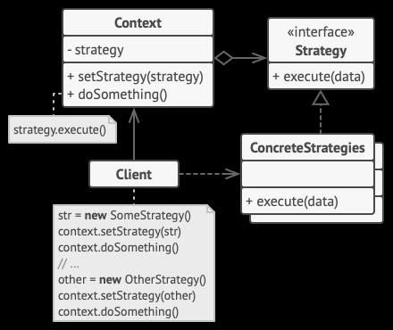

## Code Story Highlights

- Usage of datastruture like queues:
  - For implementing whats next feature and to go over again problems that you had your dificulties solving.
- usage of Design Patterns:
  - Strategy Pattern for DSA Problems.
  - Composite Pattern: TermStorage: 
- SOLID Patterns
  - Liskov Substitution Principle for Different variants of Quizzer and QuizzerWithDSA. Which methods of Quizzer ccan be called for QuizzerWithDSA without breaking it.
- Multithreading optimization Throguh Javascripti runtime environment:
  - For fetching data such as reports while doing something else
  - Such as creating a new Process without substituting the current threads
- Testing:
  - Functional Testing: Core functions requirements such as that it could run for all DSA problems.
    - Quality Assurance 
  - Many were TDD: much of the features had unit tests created since the code base were large with mocks and stubs for each expected specificatin
  - Examples in the Queues, (Term Schedulers), Quizzer Classes 
- Cool JS features:
  - Printing Tables

- Features Feedback Loop API
  - How Cloze DSA idea came out. Because sometimes you dont need to know the whole problem, but just the part that you are having trouble with.
  - Term Scheduler + Mini Term Scheduler: For example you want to look at problems you did wrong but also have a pile for learning, Working Set and Finished set while the other only sastified with one pile but is good so it implements in a format similar to the Term Scheduler: This was because there was no Internet sometimes, or the backend suddenly broke and it was waiting too long for an API requeust. So I made it instead internally using internal storage..
  - Unused API Removed: Like CSV Support for flashcards.

### Notes

**Strategy Pattern**

Imagine that you have to get to the airport. You can catch a bus, order a cab, or get on your bicycle. These are your transportation strategies. You can pick one of the strategies depending on factors such as budget or time constraints.

In the same way you can think of each algorithm as just a different strategy looking to the objective of being ran with some inputs for some outputs.

**Composite Pattern**

