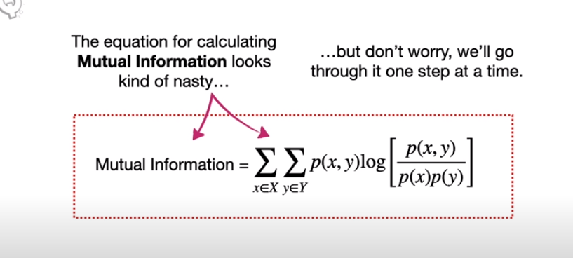

### Mutual Information 
Sure! I'll explain mutual information as if I were talking to a high schooler.

Mutual information is a concept used to measure how much two things are related or provide information about each other. It helps us understand how knowing something about one thing can give us information about another thing.

Imagine you have two sets of data, like the scores of students on two different tests. Mutual information helps us answer questions like: If we know how well a student did on one test, can we predict their performance on the other test?

Mutual information tells us how much we can learn about one test from knowing the scores on the other test. It measures the extent to which the knowledge of one test score reduces uncertainty or provides useful information about the other test score.

Here's a simple way to think about it: If the two tests are completely unrelated, knowing the score on one test wouldn't tell you anything about the score on the other test. The mutual information would be low because there is no information shared between the two.

On the other hand, if the two tests are strongly related, knowing the score on one test could give you a lot of information about the score on the other test. The mutual information would be high because the scores on one test would provide valuable clues or hints about the scores on the other test.

So, mutual information helps us understand how much two things share information or how much knowing something about one thing helps us predict or understand something about another thing. It's a useful concept in various fields like data analysis, machine learning, and information theory.

